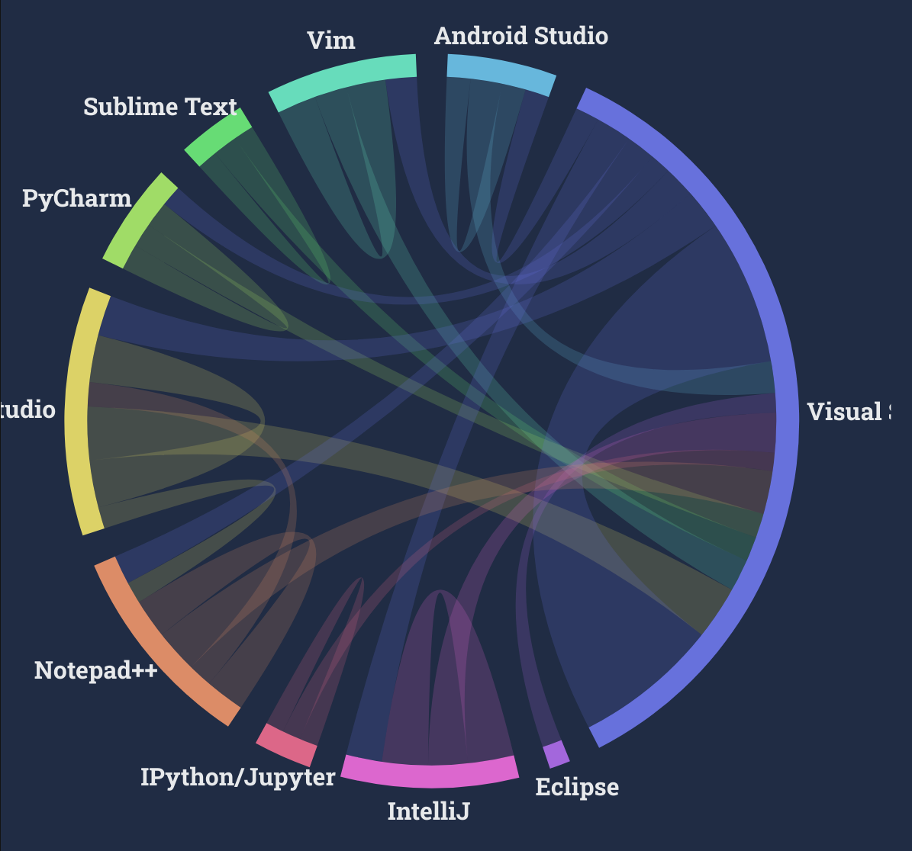
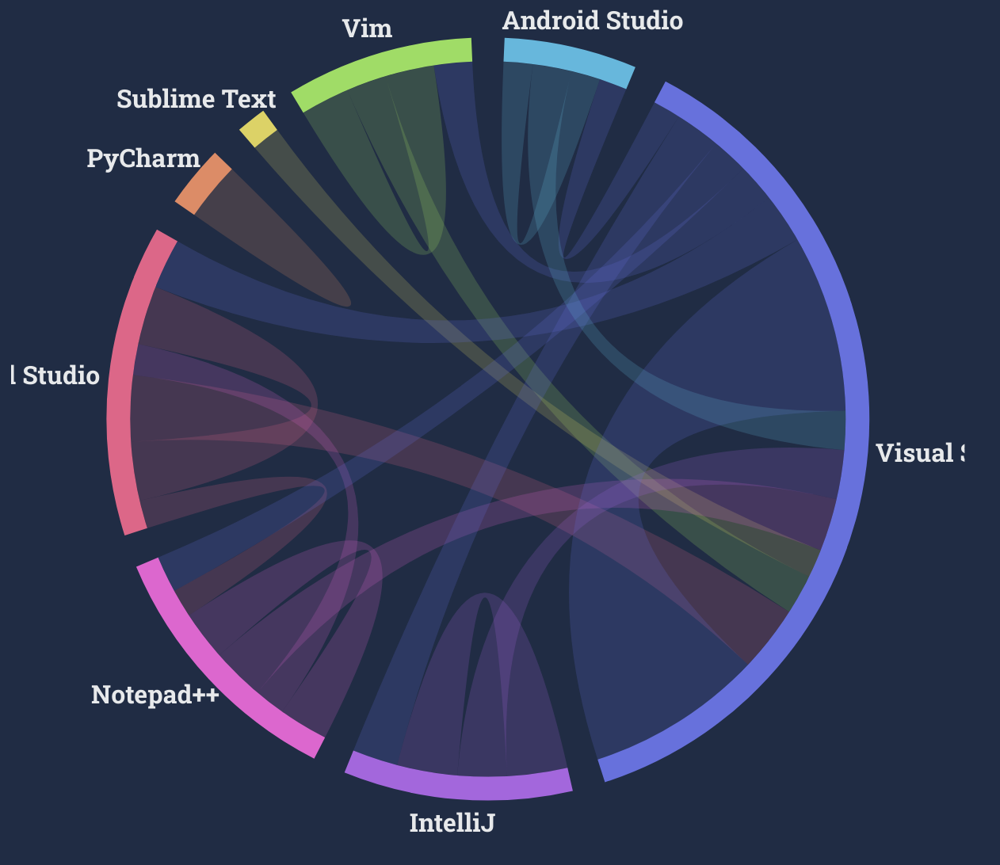
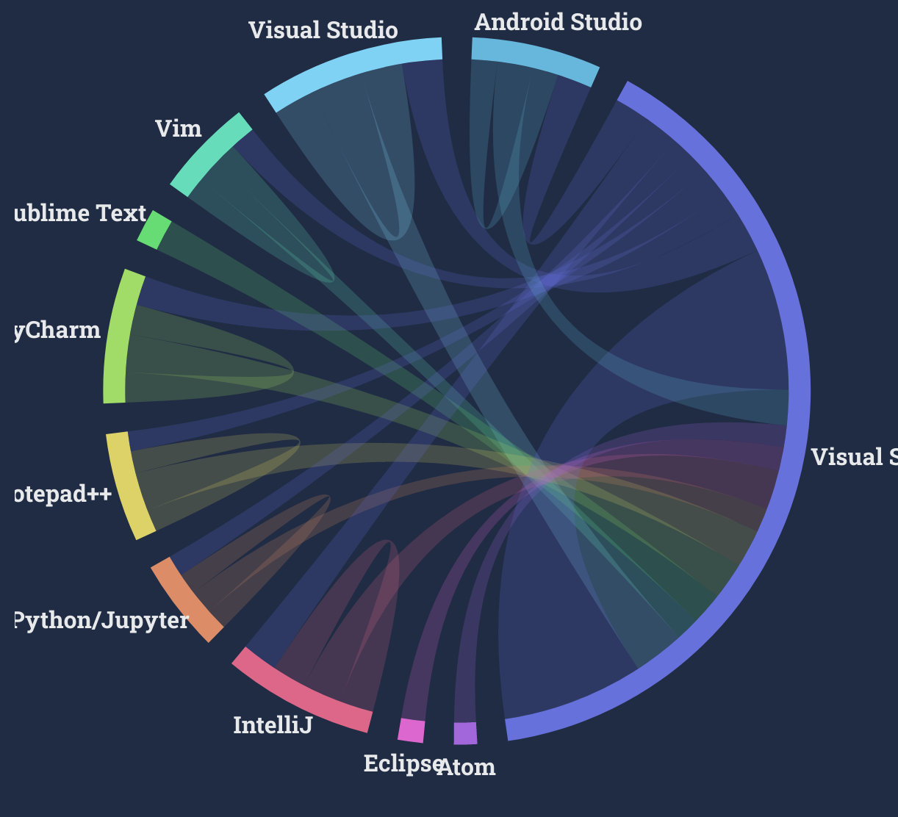

| [home page](https://alex7li.github.io/DataStories/) | [visualizing debt](visualizing-government-debt)

For this assignment, we will be critiquing and trying to improve on a visual from the stack overflow web developer survey. It's quite eye catching, let's look at it together.

# Visual to Critique

## Integrated Development Environment

VS Code is the most interconnected IDE among all respondents, Professional Developers, and those learning to code. People who are learning to code have more IDEs they want to work with - IPython/Jupyter, Eclipse, Atom - than Professional Developers.

All

Professional Devs

Learning to Code

[Click here for an interactive version](https://survey.stackoverflow.co/2022/#section-worked-with-vs-want-to-work-with-integrated-development-environment)

## Critique

### Overall Observations

This is an interesting visualization and the use of color to display movement was really nice too look at. I enjoy how it is secretly a pi chart crust, so it's easy to compare categories. However, the pi chart is representing a somewhat wierd concept 'the sum count of people who want to use or are using this thing'. Also, some data has been removed to keep it clean. I think I would use to have 2 lines for 'using' and 'want to use' instead of a circle, and then instead of cutting out relations I would make an 'other' category and reduce the number of categories. If the user is interested in a specific software which is 'other', then I would let them modify the other category by clicking it (it might be a bit hard to implement with our tools, though).

### Primary Audience

The audience here is all developers, and I think many of them are looking at this data with some interest in seeing what technologies are worth learning. I think this visual is pretty relevant for them since they can see not only where they are but where they might want to go next.

### Final Thoughts

I think that this data visualzation method is somewhat successful at reaching the target audience. I would change the color scheme to be consistent for all categories. I would also change the pi chart representing interconnectedness to two interconnected lines representing 'currently used' and 'want to use'.

- Usefulness: 10

I rank this visualization as 10/10 for usefulness.
It's very interesting to know which IDE is the most popular, and the visual also shows churn and comparison between usage of people learning and who are experts, so it feels quite compelte. The intended audience 'users of stackoverflow' might use this to determine what IDE is worth learning and using.

- Completeness: 9

It's a bit unclear with the static image, but in the interactive version, when you hover over a grouping, it tells you what the area represents. So I don't feel that there
is any confusion in what everything means. The only thing
that is incomplete is an explanation for why not all arrows
are included: not all category pairs have lines between them
and it's not stated which arrows were filtered out.

- Perceptibility: 7/10

The most important information for me is probablly which of the categories is the largest, and that's communicated instantly from the pie chart visual. I'm also interested in comparing the churn of technologies, since technologies that people don't want to stick with might not be good to use. This is shown but it's a quite hard to compare percentages between the categories since so much is going on and some filtering has occured.
Also, the change between professional devs and learning to code is hard to see because they are two different visuals.
Still this is acceptable because the graphic has a lot of information to show and I can pretty easily grasp the main points.

- Truthfulness: 4/10

It looks like they has cut off any sufficiently small categories to prevent visual clutter. However, this makes
it really unclear what I can trust the pi chart of the diagram and it leads to crazy conclusions like "<i>every</i>
professional developer using subline text wants to use VS code". I don't think it was created with the intent to misrepresent the categories, but it is very misleading.

- Intuitiveness: 5/10

It's confusing! It took me a while to understand that the
direction of the churn arrows is based off of their color.

Since self-loops have double thickness, the amount that the pi chart is visualizing is 'number either using or want to use' while my expectation was 'number using' for a long time.

That said, the colors make the movement of people very clear
and the interactiveness helps clear up most of the confusion quite quickly. Considering that the chart is pretty complex, I think it is ok overall.

- Aesthetics 8/10

I saw this chart and was instantly impressed by how pretty it was, so it has to score high! Since the colors aren't consistent between charts, I need to dock points though.

- Engagement 7/10

This is a bit hard to answer. I guess it is engaging since the audience can use it to argue why their favorite editor is the best. I could see myself showing it to someone.

## Redesigns

When looking through the survey data, I realized there is another source of big confusion, since each survey response is a list of prior technologies and a list of desired future technologies. This means using a Sankey diagram as I originally planned doesn't make sense. Quite sad, because I wanted to try it :(. Anyways, I played with the values a lot and got these two very different charts.

## Survey

**Student, ~20s, Female**
First chart has too many colors and everything is squished. The y axis has no percentage label so it's not clear what it means. Hard to map the colors shown in the legend to the values.

Hard to understand the second chart without the interactive labels. Not clear what IDE means.

**Student, ~20s, Male**
First chart: it is very hard to see the values that are small without interaction. Overall, I can conclude that vscode is the most popular.

Second chart: I don't like that the x axis labels are not all visible. The word 'churn' reflects the opposite of what is going on, it should be 'retention'. I like map visualizations. It would be cool to do it by country.

## Final Version

<noscript></noscript><object class='tableauViz'  style='display:none;'><param name='host_url' value='https%3A%2F%2Fpublic.tableau.com%2F' /> <param name='embed_code_version' value='3' /> <param name='site_root' value='' /><param name='name' value='IDERetention2021&#47;IDERetentionHeatmap' /><param name='tabs' value='no' /><param name='toolbar' value='yes' /><param name='static_image' value='https:&#47;&#47;public.tableau.com&#47;static&#47;images&#47;ID&#47;IDERetention2021&#47;IDERetentionHeatmap&#47;1.png' /> <param name='animate_transition' value='yes' /><param name='display_static_image' value='yes' /><param name='display_spinner' value='yes' /><param name='display_overlay' value='yes' /><param name='display_count' value='yes' /><param name='language' value='en-US' /></object>

